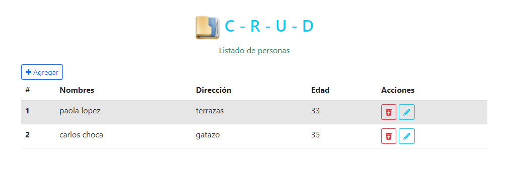

## Crud Básico con VUE JS - PHP - MYSQL

# Pasos para funcionar el sistema:
### 1 .- Importar el script de la base de datos.
### 2 .- Cambiar la configuración de la conexión:
* Ir a config.php:
  
    $con = new PDO("mysql:host=localhost;dbname=db_crudbasico", "root", "root");

# Vista del sistema:

## _Realizado por:_

# Github: @CarlChokSanc

## The MIT License (MIT)

### Este programa o sistema puede ser tomado como guia o enseñanza para sus futuros  proyectos.
Copyright (c) 2021 harlericho